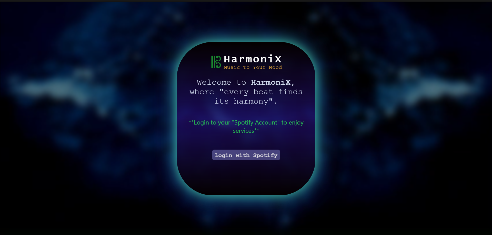
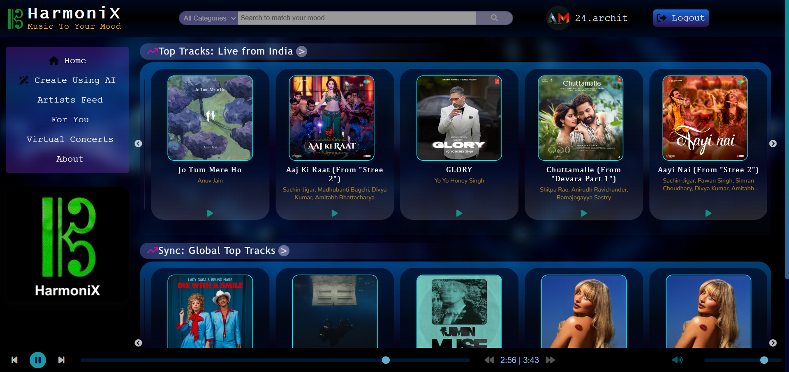
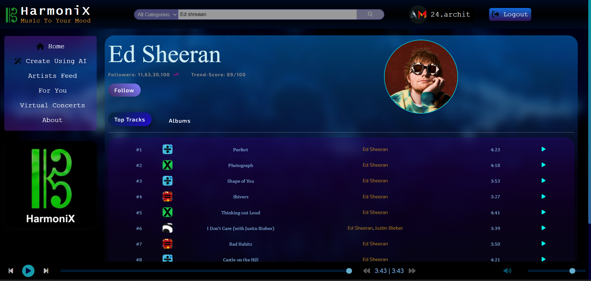
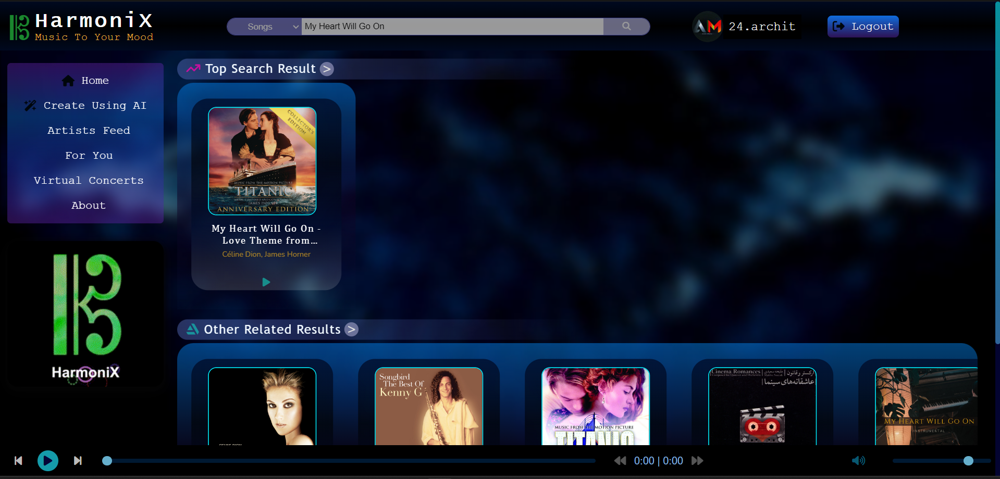
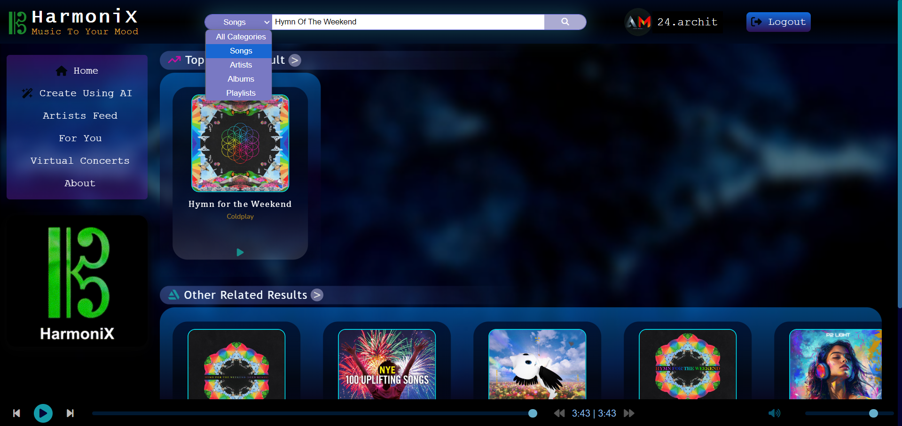
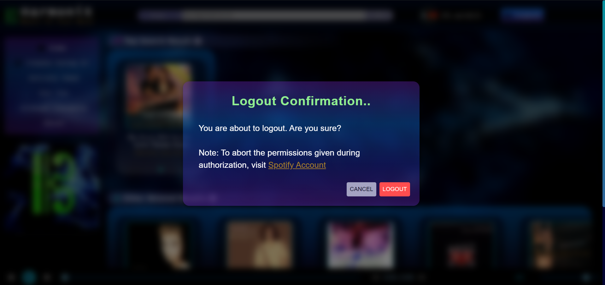

# HarmoniX - Music To Your Mood 🎵

  <strong>HarmoniX</strong> is a full-stack web application designed to elevate your music streaming experience. Integrating with the Spotify Web API, HarmoniX allows you to explore diverse playlists, discover new tracks, and seamlessly stream your favorite music. Enjoy real-time trending songs, manage your playlists, and effortlessly search for your desired artists, albums, and songs.

<h2>🌐 Live Demo</h2>

  Experience the application live: 
  <a href="https://harmonix-play.vercel.app" target="_blank">
    HarmoniX - Play Music
  </a>

<h3>Website Screenshots:</h3>

<strong>Login Page:</strong>

<strong>Home Page:</strong>

<strong>Artist Page:</strong>

<strong>Search Page:</strong>

<strong>Logout Page:</strong>

<h2>📜 Features</h2>

<ul>
  <li><strong>🎧 Dynamic Music Streaming:</strong> Seamlessly stream tracks and audio across the globe without interruptions or ads.</li>
  <li><strong>🌍 Trending Songs:</strong> Access real-time trending songs in India and globally.</li>
  <li><strong>🔍 Search Functionality:</strong> Discover your favorite tracks, artists, playlists, and albums with a powerful and intuitive search bar.</li>
  <li><strong>🎛️ Spotify Integration:</strong> Securely connect and authenticate with your Spotify account to unlock full access to HarmoniX’s services.</li>
  <li><strong>🔑 Secure Authentication:</strong> OAuth 2.0 authentication and cookie management ensure secure login and session persistence.</li>
  <li><strong>🔄 REST APIs:</strong> Backend-to-frontend communication powered by REST APIs, enabling smooth data retrieval and manipulation from Spotify.</li>
</ul>

<h2>🛠️ Technologies Used</h2>

<h3>Frontend:</h3>
<ul>
  <li><strong>HTML5</strong></li>
  <li><strong>CSS3</strong></li>
  <li><strong>JavaScript (ES6)</strong></li>
  <li><strong>React</strong> - A powerful framework for creating interactive user interfaces.</li>
</ul>

<h3>Backend:</h3>
<ul>
  <li><strong>Node.js</strong> - JavaScript runtime environment for server-side development.</li>
  <li><strong>Express.js</strong> - Web application framework for handling routing and middleware.</li>
</ul>

<h3>Database:</h3>
<ul>
  <li><strong>SQL</strong> - For handling relational data management.</li>
</ul>

<h3>APIs:</h3>
<ul>
  <li><strong>Spotify Web API</strong> - Provides access to Spotify's vast library of music, allowing HarmoniX to fetch and manage track, artist, and playlist data.</li>
</ul>

<h2>🛡️ Security</h2>

<ul>
  <li>OAuth 2.0 for user authentication ensures that users can securely login with their Spotify account.</li>
  <li>Cookie management for session persistence and to safeguard user data.</li>
</ul>

<h2>📈 Future Enhancements</h2>
<ul>
  <li><strong>Responsive Design:</strong> Enhance the platform's user interface by implementing responsive design techniques. The app will adapt seamlessly to various screen sizes and devices, ensuring an optimal user experience across desktops, tablets, and mobile devices.</li>
  
  <li><strong>AI-Powered Recommendations:</strong> Integrate machine learning algorithms to deliver personalized song suggestions based on user listening habits. By analyzing user behavior and preferences, this feature will provide tailored music recommendations to improve user engagement and satisfaction.</li>
  
  <li><strong>AI-Generated Playlists:</strong> Enable users to create custom playlists powered by AI. The system will use advanced algorithms to automatically generate playlists based on mood, genre, or specific user criteria, offering a personalized music discovery experience.</li>
  
  <li><strong>Artist Feed:</strong> Introduce a dedicated feed for users to follow their favorite artists. Artists can share updates, new releases, exclusive content, and behind-the-scenes moments directly with their fans, creating a more engaging and interactive experience.</li>
  
  <li><strong>Virtual Concerts:</strong> Implement a virtual concert feature that allows users to attend live performances in a digital environment. Leveraging technologies like VR or interactive live streams, users can experience concerts from anywhere in the world, offering a new level of accessibility and immersion.</li>
  
  <li><strong>Collaborative Playlists:</strong> Allow multiple users to collaborate on playlist creation in real-time. Users can invite friends to add songs, vote on tracks, and curate shared playlists, perfect for parties, road trips, or shared music experiences.</li>
  
  <li><strong>Music Discovery Through Social Sharing:</strong> Add social integration features that enable users to share their favorite tracks, playlists, or live concert experiences directly with friends on social media platforms, fostering community and music discovery.</li>
  
  <li><strong>Lyrics Integration:</strong> Provide real-time lyrics display for songs, allowing users to sing along and better engage with the music. This feature would sync lyrics with the song playback for an interactive experience.</li>
  
  <li><strong>Offline Mode:</strong> Implement an offline mode that allows users to download songs and playlists for listening without an internet connection. This is essential for users who want to enjoy music on the go, even in areas with limited connectivity.</li>
  
  <li><strong>Music-Driven Wellness:</strong> Introduce wellness-focused playlists and features that use AI to curate music for specific activities, such as meditation, sleep, or workouts. These playlists would adjust based on user preferences and activity data.</li>
  
  <li><strong>User-Created Stations:</strong> Let users create personalized radio stations based on favorite artists, genres, or moods. These stations would continuously play similar tracks, helping users discover new music while enjoying their favorites.</li>
  
  <li><strong>Interactive Podcast Integration:</strong> Expand beyond music by integrating podcasts with interactive features. Users can engage with podcasts through real-time discussions, polls, and Q&A with the hosts, creating a richer audio experience.</li>
  
  <li><strong>Enhanced User Analytics:</strong> Provide users with detailed insights into their listening habits, including favorite genres, most-played songs, and listening patterns over time. This feature would offer personalized listening stats and achievements.</li>
</ul>

### 📝 License

This project is protected under a **Custom Proprietary License**.  
Usage, reproduction, modification, or distribution of the code is not permitted without prior written consent from the author.
For further details, please see the [LICENSE](./LICENSE.txt) file.

<h2>🙌 Acknowledgments</h2>

<ul>
  <li><strong>Spotify</strong> for providing an exceptional Web API.</li>
  <li><strong>Node.js</strong> and <strong>React</strong> communities for their excellent tools and documentation.</li>
</ul>

